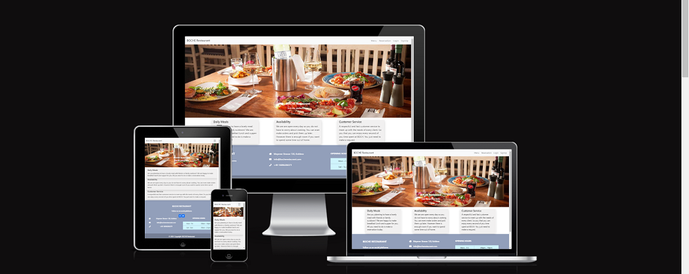
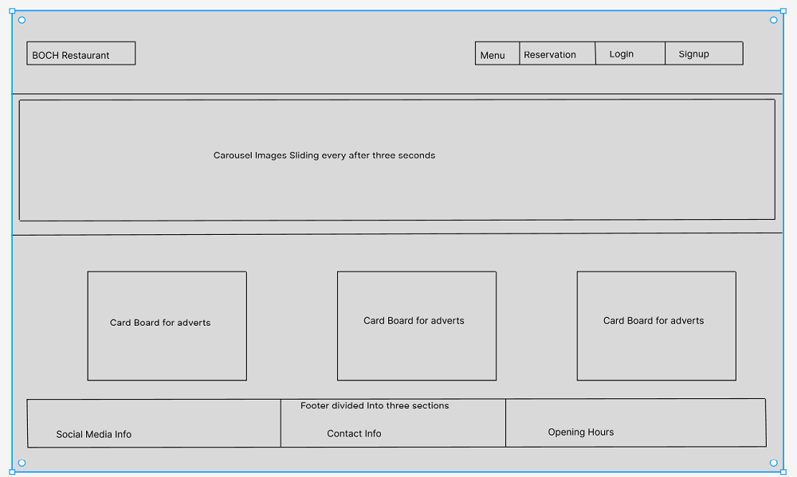
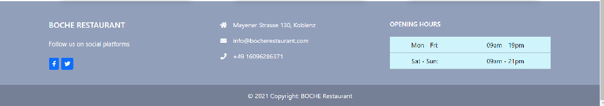

Display 

Live URL:[BOCHE Restaurant](https://bocherestaurant-7ba3daeb5c57.herokuapp.com/)

BOCHE Restaurant is a reservation application designed to help users make
reservations before going to the Restaurant. Users will be able to create an
account, then login before being granted access to making a reservation. A user
can create, view, update and cancel reservations. However for security purposes,
a user can only see his or her own reservation, while the admin(in this case the
the Restaurant management) can manage all user reservation. A particular number
of Tables are created with given capacity and then the tables are assigned to
users based on the number of people they input on their reservation. A maximum
number of five people is is allowed and in case a user tries to make reserve
a pariticular date and time where 5 other reservations have been made then he or
she will get a message notifying them there is not available tabe at that time.
Tables assigned to users will always be greater than or equal to number of people.

## Project Goals

### User Goals

- The user wants to be able to make reservations so that they are sure about
  having a table when they go to eat.
  - The user also wants to be able to manage his reservations so that he can make
  changes or cancel before time when it is not possible.
  
### Site Owner Goals

- The site owner wants to be able to receive reservations from customers before
  they visit the Restaurant so as to keep an orderly environment.
  - The site owner also wants to present a menu to users so they can make up their
  minds even before stepping into the restaurant.

## Design

Used [Figma](figma.com) to design how the website should look on a computer.

 

## Site Flow

## Technologies Used

- Languages

  - Python
  - HTML
  - JavaScript
  - CSS

- Tools

  - Codeanywhere
  - Figma
  - Bootstrap
  - Heroku
  - Git
  - Github
  - CI Python Linter

## Existing Features

- Navigation Menu
  
  There is a navigation menu at the top to help users navigate the pages of the
    website easily. To the left is the name of the website acting as a logo.
    
  
- Footer

  There is a footer to the bottom of every page. Useful information such as open
    hours, address and contact details can be seen in the footer.
    
  
- Restaurant Menu

  There is a Menu page showing the different meals and drinks users can consume at
    BOCHE Restaurant. This helps users to prepare their minds before coming to eat.
    
  
- Add Reservations

  There is an add reservation page, where the users fills in his information for
    his reservation, selects date and time then submits. He is notified with if this
    reservation is a success or not with a message.
    
  
- View Reservations

  A user can only view his own reservations. While the admin can manage all the
    reservations in the database.
    
  
## User Stories

<table>
    <tr>
        <th>Milestones</th>
        <th>User Story</th>
        <th>Acceptance Criteria</th>
    </tr>
    <tr>
        <td>Basic Functionality</td>
        <td>
            
As a developer I can set up a Django project so that code for the intended application can be written.

            
As a developer I can create a base.html template so that it extends to other templates and we avoid repetition and remain consistent.

            
As a developer I can create a navigation menu so that users can easily navigate through the application.

            
As a developer I can create a website footer in the base template so that it extends to other templates and we display some useful information there.

            
As a developer I can deploy my empty project so that I confirm everything as far as deployment is concern works well to avoid last minute surprises.

        </td>
        <td>
            
Django project should be setup with required libraries installed

            
A base template that extends to the other templates should be created

            
A navigation menu should be made for users to easily browse the site

            
The footer should be in the base template

            
Project should be deployed in early stages

        </td>
    </tr>
    <tr>
        <td>
            Authentication
        </td>
        <td>
            
As a site user I can create an account so that I make, see, update and cancel my reservations.

            
As a site user I can login to my account using username and password so that I check, cancel, or make a reservation.

            
As a site user I can logout from my account so that my information is safe and reservations are saved.

            
As a site admin I can login to the admin page so that I manage reservations made by site users.

            
As a site admin I want users to receive notifications when they login or logout so that their user experience is better.

        </td>
        <td>
            
User can signup by providing some required information

            
User can login using user name and password

            
User can logout from his/her account by clicking logout

            
There should be an admin(Super User) that has access to all reservations

            
Users are notified when they login, make, update or cancel reservations

        </td>
    </tr>
    <tr>
        <td>
            Reservation
        </td>
        <td>
            
As a site user I can make a reservation so that I am sure to get a table and food in the restaurant on the date and time of my reservation.

            
As a site user I can see my reservation so that incase I forget the details I can login and to check.

            
As a site user I can change my reservation so that incase of any emergency or changes in my schedule I still get a chance.

            
As a site user I can cancel my reservation so that in the case where I can not be there on the reserved date I can notify the managers by just canceling the reservation.

        </td>
        <td>
            
Users can make reservations by filling a form and submitting

            
users can later check their reservations by login in and clicking on reservations

            
Users can edit their reservations and resubmit

            
Users should be able to cancel a reservation they made 

        </td>
    </tr>
    <tr>
        <td>
            Authorisation
        </td>
        <td>
            
As a site user I can only make a reservation if I am logged inn so that reservations I create are associated only to me.

            
As a site user I can only view my reservations if I am logged inn so that others cannot see my reservations.

            
As a site user I can only edit my reservation if I am logged in so that others cannot edit my reservations.

            
As a site user I can only cancel my reservation if I am logged in so that other users cannot cancel my reservations.

        </td>
        <td>
            
A user can only make a reservation when he/she login

            
A users reservation can only be viewed when they login except for admin users

            
A reservation can only be edited by the logged in user

            
The functionality to cancel a reservation is only available when user is logged in

        </td>
    </tr>
    <tr>
        <td>
            Prevent Double Booking
        </td>
        <td>
            
As a site user I can only make a reservation if there is an available table so that the tables are not double booked.

            
As a site user I can be notified about the status of my reservation so that I know if the reservation was successful if not why.

        </td>
        <td>
            
If more than 5 users have made reservations at a particular time and date then a sixth user can't reserve for that same time and date

            
When a user updates, cancels or make a reservation, they should be notified

        </td>
    </tr>
    <tr>
        <td>
            Add CSS Styling
        </td>
        <td>
            
As a restaurant owner I would like my login page responsive so as to improve user experience while login in.

            
As a restaurant owner I would like my signup page to be responsive so as to improve user experience when they signup.

            
As a restaurant owner I would like my add_reservation page to be responsive so as to improve user experience when they make a reservation.

            
As a restaurant owner I would like my homepage to be responsive so as to improve user experience when the visit the restaurant website.

            
As a restaurant owner I would like my logout page to be responsive so as to improve user experience when they logout.

            
As a restaurant owner I would like my Menu page to display the restaurant menuso that customers can have an idea of what to eat before coming on the day of their reservation.

        </td>
        <td>
            
Login page is responsive when browsed on other devices

            
Signup page is responsive

            
Reservation page is responsive

            
Home page is responsive

            
Logout page is responsive

            
Menu page is responsive

        </td>
    </tr>
    <tr>
        <td>
            Testing and Documenting
        </td>
        <td>
            
As a site developer I can write tests for my application so that In the process I confirm it works like I want it to.

            
As a site developer I can write a readme file for my application so that other developers can read it to better understand my code.

        </td>
    </tr>
</table>

## Testing

- Test for this website are divided in to two categories. Automated test as seen
in our test_forms.py file and manual test carried out as seen in the table below

<table>
    <tr>
        <th>Action</th>
        <th>Expected Results</th>
        <th>Actual Results</th>
    </tr>
    <tr>
        <td>Enter live link for BOCH Restaurant in browser</td>
        <td>Home page loads with new user not logged in</td>
        <td>Pass</td>
    </tr>
    <tr>
        <td>Click on Reservation when not authenticated</td>
        <td>Site navigates to login page</td>
        <td>Pass</td>
    </tr>
    <tr>
        <td>Click on Reservation when authenticated</td>
        <td>Site displays user's reservations if they have and a link to make a reservation</td>
        <td>Pass</td>
    </tr>
    <tr>
        <td>Click on link to make reservation</td>
        <td>Site opens a form where user can fill fields then submit to make a reservation</td>
        <td>Pass</td>
    </tr>
    <tr>
        <td>Click on update reservation from list of reservations displayed</td>
        <td>Site navigates to form with prefilled information from the reservation user wants to update</td>
        <td>Pass</td>
    </tr>
    <tr>
        <td>Click on delete in list of reservations</td>
        <td>User is asked to confirm they want to cancel their reservation before they do</td>
        <td>Pass</td>
    </tr>
    <tr>
        <td>Click on Menu</td>
        <td>The Restaurant Menu is displayed to the user weather he/she is authenticated or not</td>
        <td>Pass</td>
    </tr>
    <tr>
        <td>Click logout on navigation menu</td>
        <td>User is prompted to confirm the want to sign out</td>
        <td>Pass</td>
    </tr>
    <tr>
        <td>User confirms to sign out after clicking logout on navigation menu</td>
        <td>user is signed out and redirected to home page with navigation menu displaying login and sign up</td>
        <td>Pass</td>
    </tr>
    <tr>
        <td>Click on signup</td>
        <td>User is provided a form to fill his/her information and submit</td>
        <td>Pass</td>
    </tr>
    <tr>
        <td>Clicking on the Logo BOCH Restaurant at any time</td>
        <td>User is directed to the home page</td>
        <td>Pass</td>
    </tr>
    <tr>
        <td>Input user name and password then click sign in</td>
        <td>User is taken to home page provided the account exist in database</td>
        <td>Pass</td>
    </tr>
    <tr>
        <td>Sign in, Make reservation, update reservation, cancel reservation</td>
        <td>User is notified with messages if the action taken is a success or a failure</td>
        <td>Pass</td>
    </tr>
</table>

## Deployment

This application was deployed on Heroku. Below are the steps taken to successfully deploy.

1 - The requirment.txt file was populated using the command "pip3 freeze > requirements.txt"

2 - Then we move to Heroku dashboard and create a new app. The app was named bochrestaurant just like the application and Europe was selected for region because the developer is in Germany.

3 - Then we move to settings and after selecting the app we also click Reveal Config Vars to set the environment variables.

4 - Four key and value pairs were filled. Cloudinary URL, Database URL, PORT 8000 and our Secret key

5 - The next steps were clicking the deploy tab, selecting Github, searching the project by its name and then connecting to Heroku by clicking connect.

6 - Then clicking on Deploy Branch to complete the deploy. This application does not automatically deploy so each time the developer makes changes they have to come and deploy manually.

8 - Finally the application is deployed live to URL: <https://bocherestaurant-7ba3daeb5c57.herokuapp.com/>

## Credits

- Deployement

Thanks to Code Institute's Tutor support for assistance during deployment.

- Media

All images on this project were downloaded from google. However all images on the readme file itself are screenshots demonstrating different features of the application.

- Code

To better understand class based views [FBVs and CBVs](https://testdriven.io/blog/django-class-based-vs-function-based-views/)

A lot of free content on the internet like [Stack Overflow](https://stackoverflow.com/)

Special thanks to my mentor, my brother and the CI Slack Channel for support.
